# 📱 Examen Final - coderhouse-reactnative-vsolari

Este proyecto es el examen final del curso de React Native en CoderHouse. Se trata de una aplicación de Ecommerce que permite a los usuarios navegar por categorías de productos, iniciar sesión, y tomar fotos con la cámara del dispositivo. El proyecto utiliza tecnologías modernas como Redux, Expo, SQLite y Firebase para gestionar los datos y la autenticación de los usuarios.

## 📝 ¿Qué es el proyecto?

La aplicación es un ejemplo funcional de una plataforma de Ecommerce desarrollada en React Native que cuenta con las siguientes características:
- **Login y registro de usuarios:** Utilizando Firebase Authentication para la gestión segura de usuarios.
- **Categorías de productos:** Los productos están organizados por categorías para facilitar la navegación.
- **Uso de la cámara:** Los usuarios pueden capturar fotos de productos utilizando la cámara del celular.
- **Base de datos local:** Utilización de SQLite para almacenar datos de manera local.
- **Persistencia y sincronización de datos:** Firebase Realtime Database se utiliza para almacenar y sincronizar la información en tiempo real.

## 🛠️ Tecnologías Utilizadas

- [React Native](https://reactnative.dev/) 
- [Redux](https://redux.js.org/) 
- [Expo](https://expo.dev/) 
- [SQLite](https://www.sqlite.org/index.html) 
- [Firebase Realtime Database](https://firebase.google.com/products/realtime-database) 
- [Firebase Authentication](https://firebase.google.com/products/auth) 

## 📸 Screens de la Aplicación

1. **Pantalla de Inicio de Sesión**

    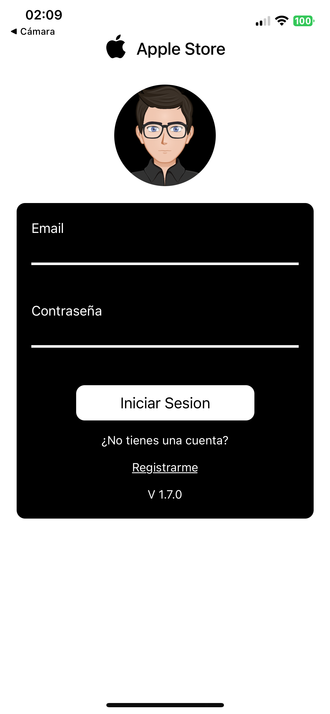
    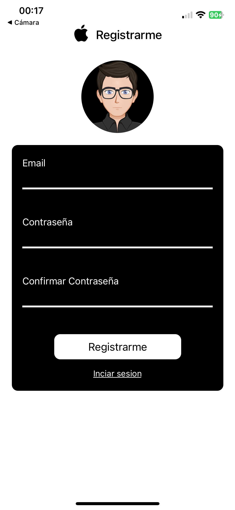
   
   Descripción: Permite al usuario iniciar sesión y registrarse mediante correo y contraseña.
    (*) La contraseña debe tener al menos una letra mayuscula, minusculas y numeros, debe ser de 8 digitos

2. **Pantalla de Categorías y Productos - Tienda**
   
    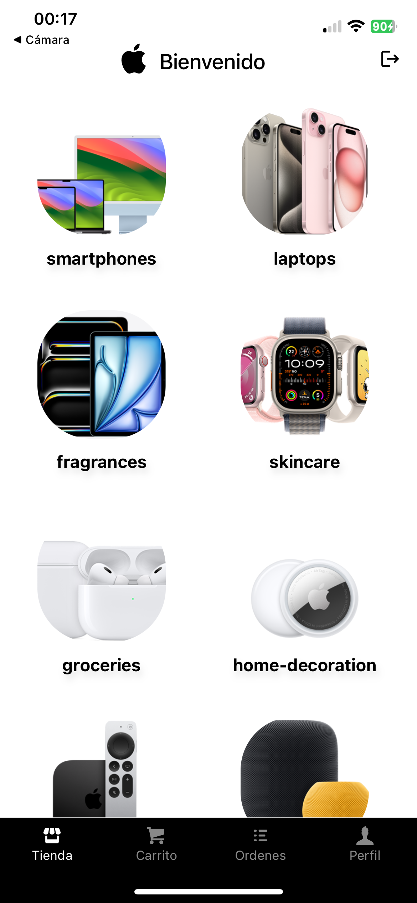
    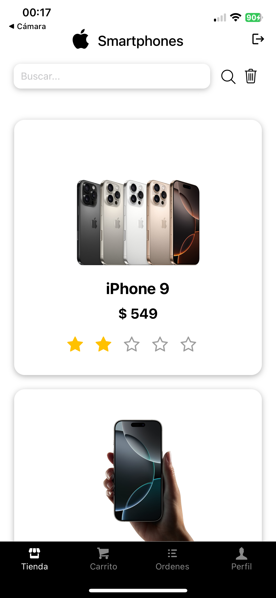
    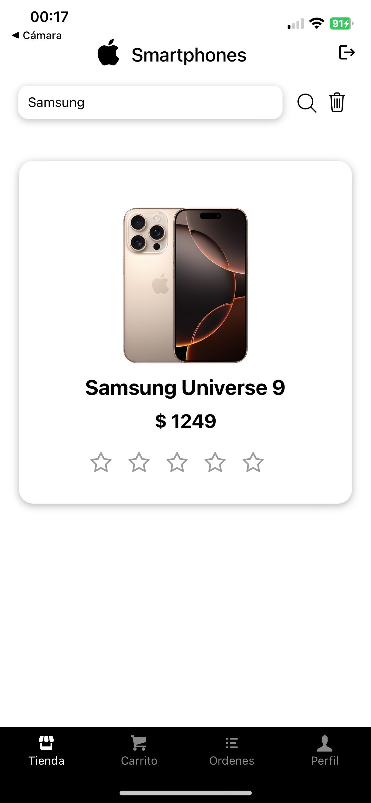
    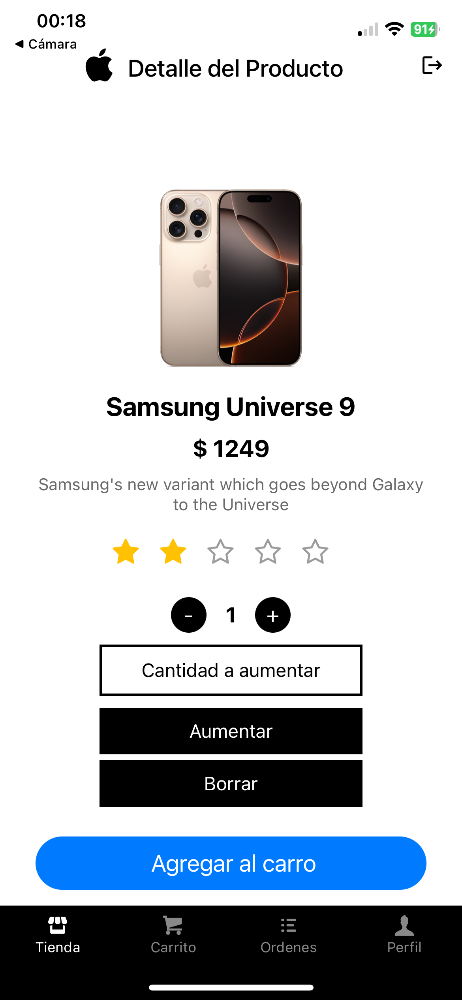        

   Descripción: Muestra las categorías de productos disponibles en la tienda, buscar un producto dentro de una categoria por su nombre y ver el detalle del producto, descripción precio y opción de compra

3. **Pantalla de Carrito**

    
    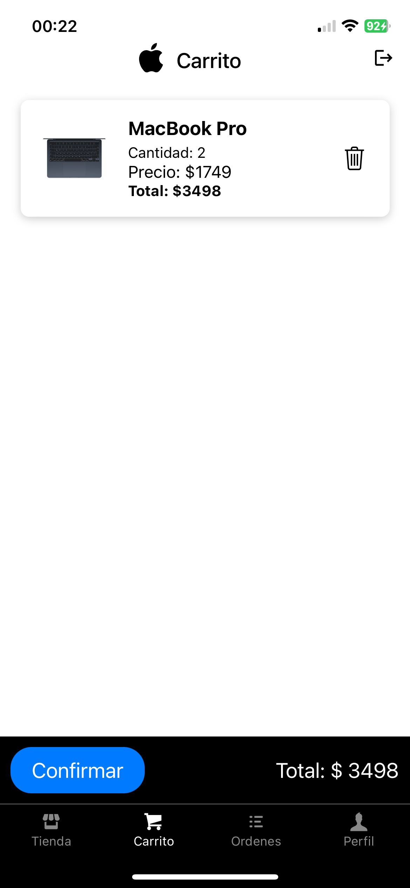

    Descripción: Muestra los productos seleccionados e incorporados al carro de compra.

4. **Pantalla de Ordenes de compra**

    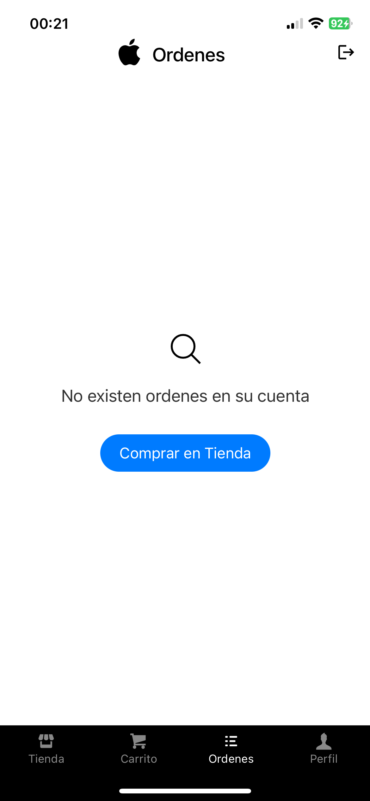
    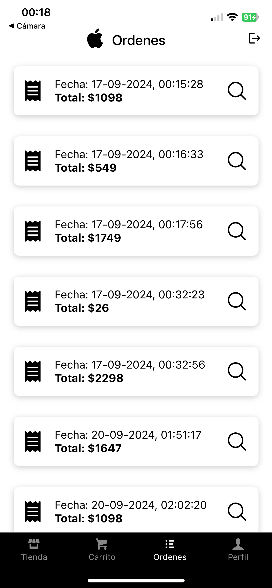
    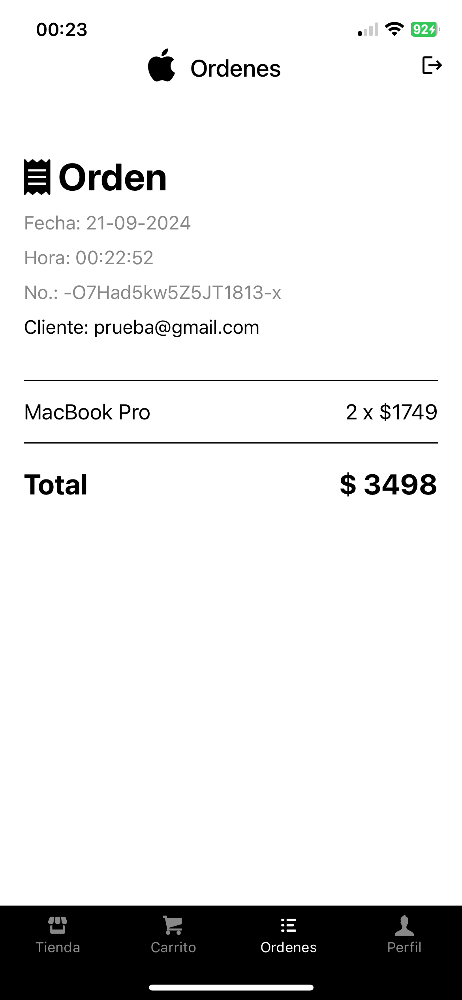

    Descripción: Muestra las ordenes realizadas por el usuario, el detalle de cada una, productos comprados, monto y cantidades

5. **Pantalla de Perfil - Uso de la Cámara**
   
    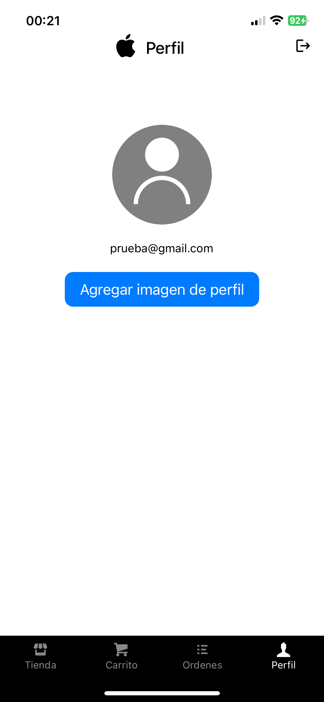
    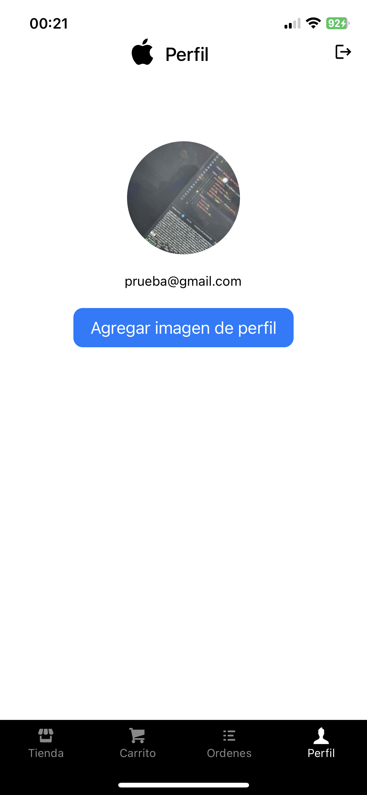
    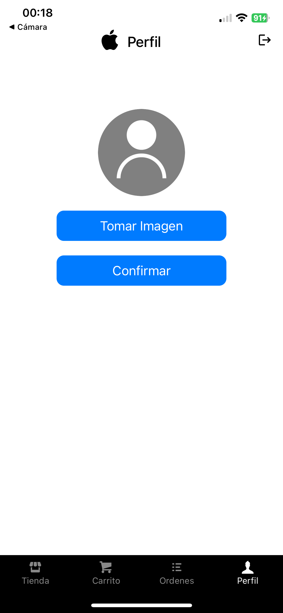
   
   Descripción: Permite al usuario tomar una foto y agregarla a su perfil


## 🚀 Instalación y Uso

1. Crear una carpeta en tu computador donde descargaras el proyecto

2. Clona el repositorio:
   ```bash
   git clone https://github.com/vsolarirelke/coderhouse-reactnative-vsolari.git

3. Ingresamos a la carpta del proyecto
   ```bash
   cd coderhouse-reactnative-vsolari

4. Instalar dependencias
   ```bash
   npm install

5. Iniciar proyecto
   ```bash
   npx expo start
